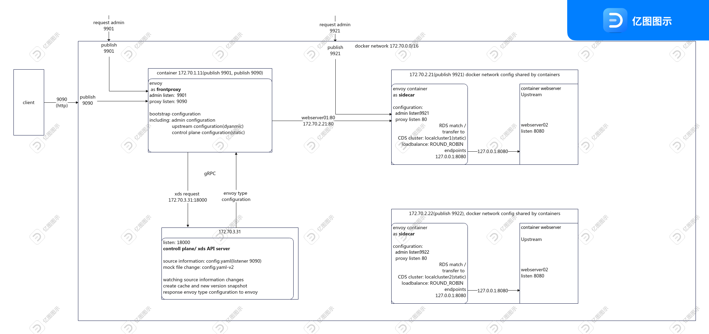

## birdview


## preface 
1. A container including envoy as front proxy
2. two web server containers including envoy woring as sidecar
3. A control plane container

## 2 front-proxy container
using image `envoyproxy/envoy-alpine:v1.20.0`

bootstrap configuration 

including: 

 - admin-interface listening 9901
 - dyanmic resource configuration pointing to gRPC server
 - static configuration for gRPC cluster server

publish 9090 to client

publish 9901 for admin request


## 3 webserver01
two containers shared network configuration, including ip, hostname, etc. They work as one server in real machine.

### envoy sidecar container

- listen 9921 for admin-interface
- listen 80 for downstream request
- using staic envoy resource configuraton

### webserver01 container
using ikubernetes/mini-http-server:v0.3 as web server

listen 8080

## 4 webserver02 
### envoy sidecar container

- listen 9922 for admin-interface
- listen 80 for downstream request
- using staic envoy resource configuraton

### webserver02 container
using jmalloc/echo-server as web server

listen 8080

## 5 xds API server / control plane container

using `ikubernetes/envoy-xds-server:v0.1` as xds API server to response xds API configuration request

listen 18000

main work of control palne

- watching source information changes
- create cache and new version snapshot
- response envoy type configurtion to envoy

## 6 validation
### check whether it works

If you configure two web server endpoints in the source information of control plane, you can check whether load balance (ROUND\_ROBIN） policy works. Send a request from host to published port 9090
```bash
while sleep 1; do echo "==============="; curl -s http://localhost:9090; echo "==============="; echo -e "\033[34m load balance:ROUND_ROBIN\033[0m"; done; 
```
### changing source information to check hot reload
modifying the source information file (yaml file in this sample) to mock the change of source information

Send a request from host to published port 9901

`curl http://localhost:9901/clusters`

`ikubernetes/envoy-xds-server:v0.1` seems have a little bug. It might not work after you modify the yaml file twice. You should restart container, then control plane reloads the new version file.  Anyway the front proxy envoy which sending gRPC request does not need to restart. It will reload the response of envoy type configuration dynamically.

## Ref 
[Dynamic configuration (control plane)  Official DOC](https://www.envoyproxy.io/docs/envoy/latest/start/sandboxes/dynamic-configuration-control-plane)

[dynamic-config-cp Github](https://github.com/envoyproxy/envoy/tree/main/examples/dynamic-config-cp)


